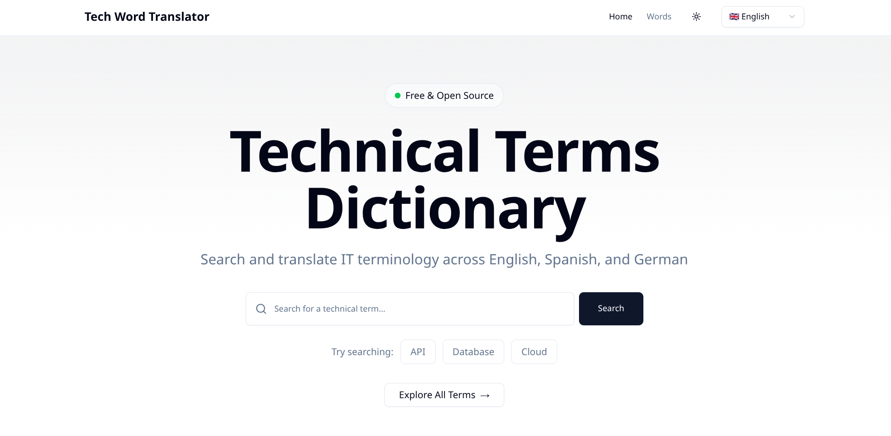
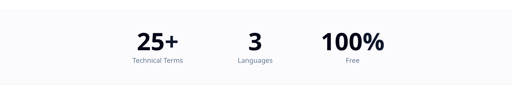
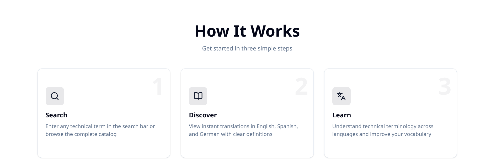
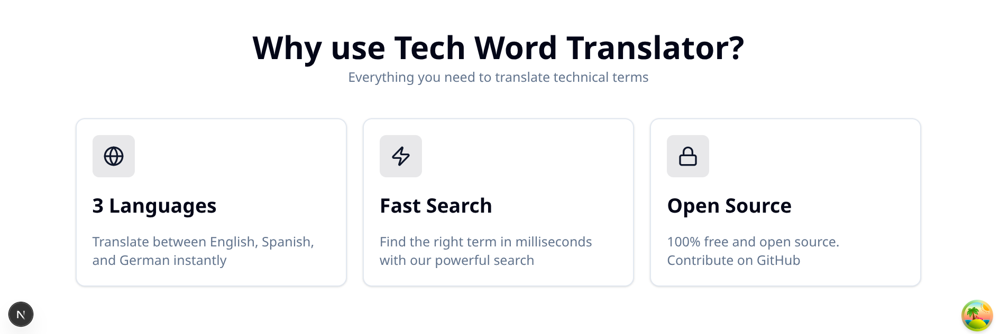
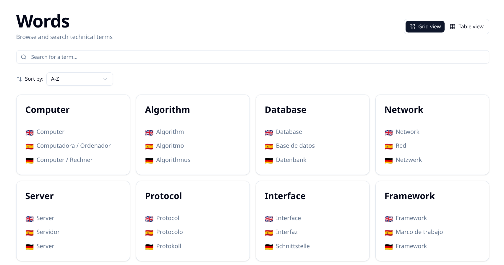
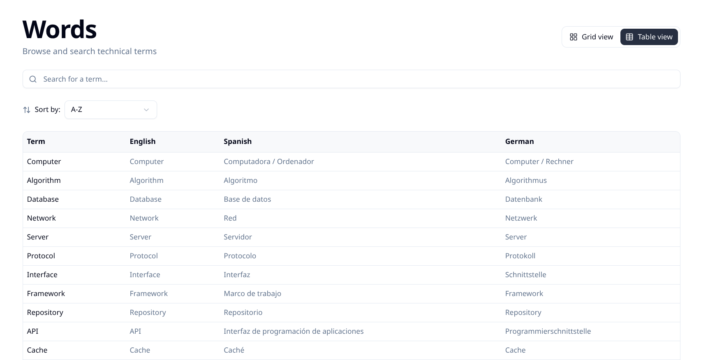
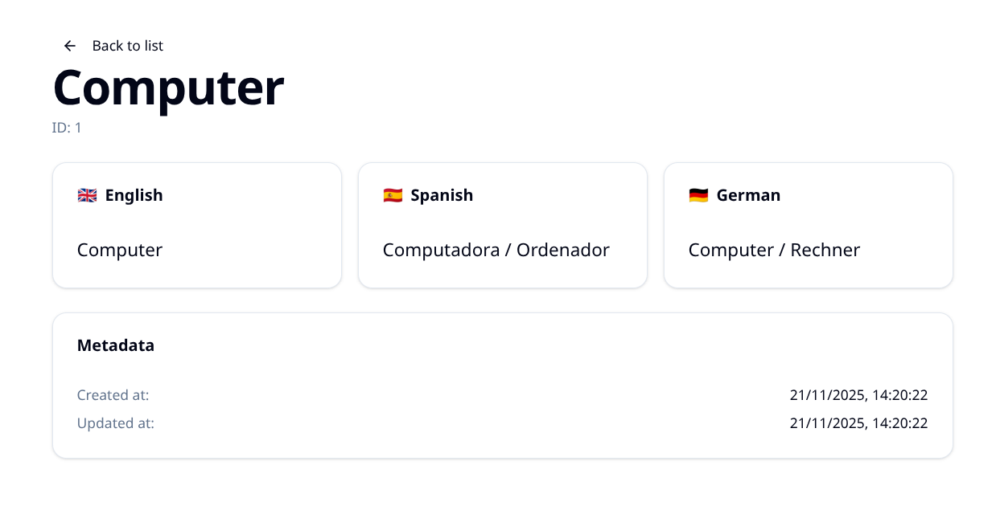
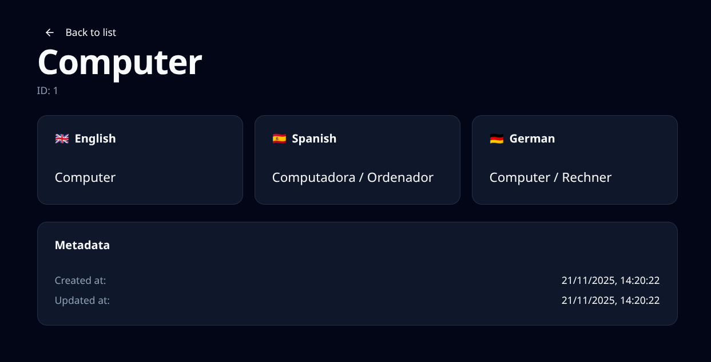
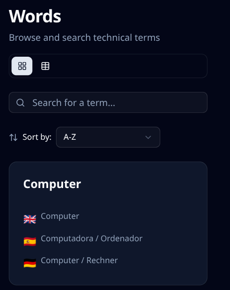

# Screenshots Gallery

Complete visual showcase of Tech Word Translator features and capabilities.

## Desktop Views

### Home Page

  
   
  <b>Home - Light Mode</b>

  
   
  <b>Home - Dark Mode (Spanish)</b>

  
   
  <b>Home - Dark Mode (German)</b>

### Home Sections

  
   
  <b>Statistics Section</b>

  
   
  <b>How It Works</b>

  
   
  <b>Features Section</b>

### Words List

  
   
  <b>Grid View</b>

  
   
  <b>Table View</b>

### Word Detail

  
   
  <b>Word Detail - Light Mode</b>

  
   
  <b>Word Detail - Dark Mode</b>

## Mobile Views

  
   
  <b>Mobile - Home</b>

  
   
  <b>Mobile - Words List</b>

---

  <a href="../../">← Back to main README</a>

